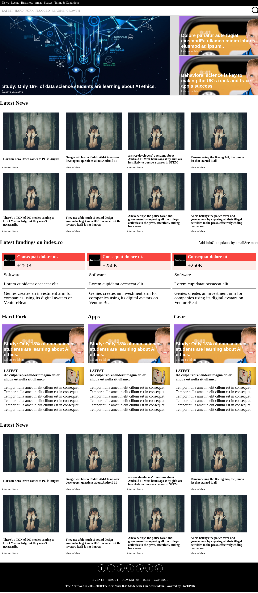

# Design Tear Down
> Luciano and Karthick 5th project in HTML&CSS3 module.

In this task we were required to create a responsive clone of https://thenextweb.com/

## Built With

- HTML,
- CSS3,

## Live Demo

[Live Demo Link](https://raw.githack.com/lucianosarno/responsiveDesign/development/index.html)

## Authors

👤 Luciano Sarno

- Github: [@githubhandle](https://github.com/lucianosarno)
- Linkedin: [linkedin](https://www.linkedin.com/in/luciano-soares-1343431b0/)

👤 Harthick Harimoorthy

- Github: [@githubhandle](https://github.com/karthykarthick)
- Linkedin: [linkedin](https://www.linkedin.com/in/karthick-harimoorthy/)

## 🤝 Contributing

Contributions, issues and feature requests are welcome! Start by:

- Forking the project

- Cloning the project to your local machine

- cd into the project directory

- Run git checkout -b your-branch-name

- Make your contributions

- Push your branch up to your forked repository

- Open a Pull Request with a detailed description to the development branch of the original project for a review

Contributions, issues and feature requests are welcome!

Feel free to check the [issues page](issues/).

## Show your support

Give a ⭐️ if you like this project!

## Acknowledgments

- Microverse
- GitHub

## 📝 License

This project is open licensed.
